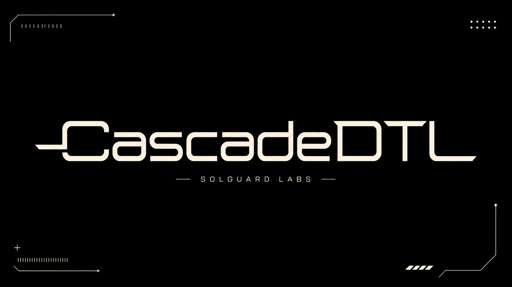
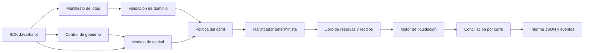
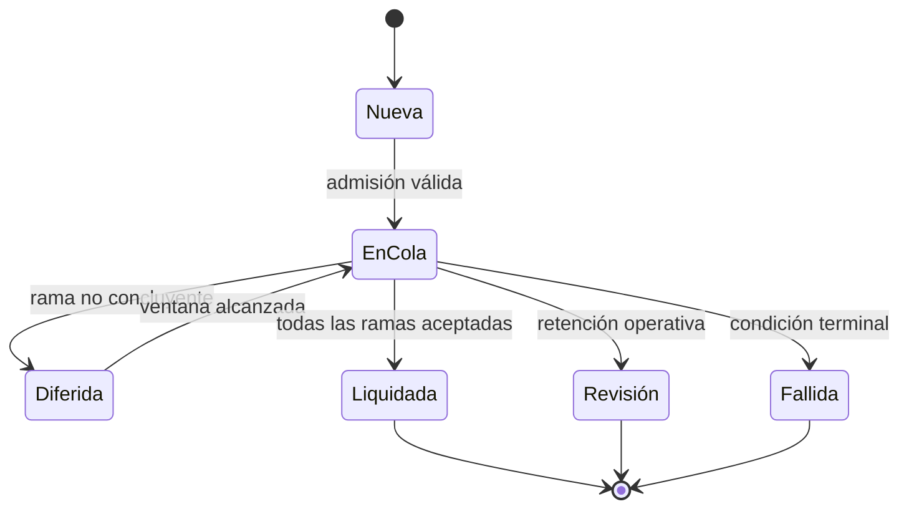
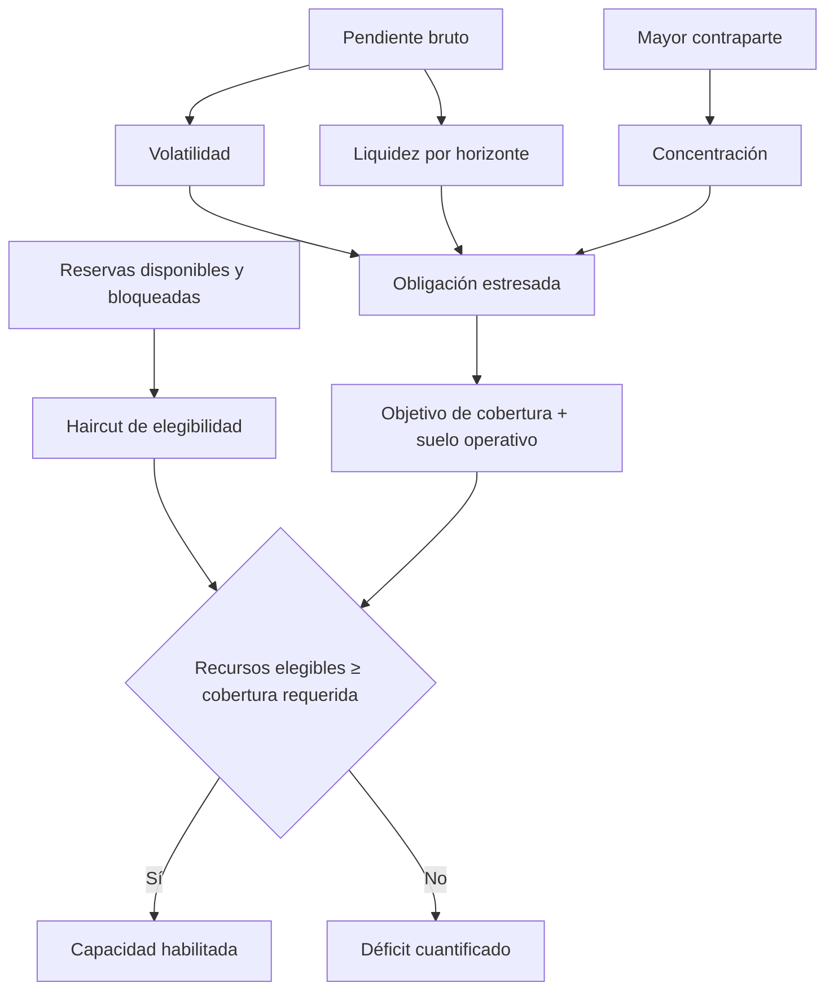

# CascadeDTL



[](https://github.com/SolguardLabs/CascadeDTL/actions/workflows/ci.yml)
[](https://github.com/SolguardLabs/CascadeDTL/releases/tag/v1.0.0)
[](https://www.open-std.org/jtc1/sc22/wg14/)
[](https://nodejs.org/)

CascadeDTL es un motor determinista de compensación y liquidación por lotes. Coordina reservas de cobertura, recibos de ejecución, carriles con políticas independientes, prioridades por congestión y reintentos diferidos sin depender de servicios externos en el núcleo C11.

La versión `1.0.0` incorpora cálculo de capital estresado, evaluación de operaciones de gobierno con dominio completo y un cliente JavaScript que conserva los importes como enteros. El resultado de una ejecución es estable byte a byte para la misma entrada, por lo que puede integrarse en conciliación, controles previos a liquidación y automatización operativa.

## Capacidades

- Liquidación de lotes ordenada por prioridad económica y presión de cola.
- Reservas segregadas por carril, propietario y estado contable.
- Recibos deterministas para correlacionar apertura, diferimiento y cierre.
- Límites por carril para importe, comisión, prioridad y tratamiento diferido.
- Cálculo de recursos elegibles, obligaciones estresadas, cobertura y déficit.
- Identificador de gobierno ligado a red, cadena, destino, llamada, payload, predecesor, ventana y salt.
- SDK sin dependencias de ejecución, con transporte local acotado y aritmética `bigint`.
- Informes JSON reproducibles, eventos ordenados y conciliación agregada por carril.

## Arquitectura



El núcleo separa admisión, ordenación, bloqueo, ejecución y reporte. Esta separación permite aplicar controles de política antes de tocar una reserva y reconstruir cada transición desde la secuencia de eventos.

## Ciclo de una liquidación



Cada paquete declara un importe bruto, una comisión, una reserva, un beneficiario y una política temporal. La prioridad efectiva combina prioridad base, congestión y refuerzo de reintento; el desempate usa la secuencia original, de modo que una misma entrada siempre produce el mismo orden.

## Modelo económico

El cálculo de capital trabaja únicamente con enteros. Para una tasa expresada en puntos básicos:

```text
eligible = floor((available + locked) × (10_000 - haircut_bps) / 10_000)

stressed = pending + fees
         + ceil(pending × volatility_bps / 10_000)
         + ceil(pending × liquidity_bps × horizon / 10_000)
         + ceil(largest_counterparty × concentration_bps / 10_000)

required = ceil(stressed × target_coverage_bps / 10_000) + operational_floor
shortfall = max(required - eligible, 0)
```



Ejemplo:

```bash
out/cascadedtl capital \
  300000 50000 180000 900 90000 \
  800 650 40 1200 3 12500 25000
```

El resultado separa cada ajuste, la obligación estresada, la cobertura requerida, el excedente o déficit, el ratio de cobertura y el peso de la mayor contraparte.

## Gobierno operativo

Una operación queda identificada por el dominio completo:

```text
operation_id = H(
  version | protocol | network | chain_id | target | selector |
  payload_digest | predecessor | salt | eta | expires_at | quorum
)
```

La evaluación exige quórum, fin del timelock, predecesor satisfecho y una ventana aún vigente. Cambiar un solo campo produce otro identificador.

```bash
out/cascadedtl governance \
  CascadeDTL testnet 84532 reserve-registry set-policy \
  8a36f1 none 2026q3 1700000000 1700003600 3 3 1700000100 1
```

## Inicio rápido

Requisitos:

- Node.js 24.
- Un compilador C11: `cc`, `gcc`, `clang` o MSVC.

```bash
npm ci
npm run build
npm test
```

Validar y ejecutar un manifiesto:

```bash
out/cascadedtl validate tests/fixtures/balanced_settlement.json
out/cascadedtl run tests/fixtures/balanced_settlement.json --json --events
```

En Windows, `scripts/build.mjs` detecta MSVC y sus entornos de compilación conocidos. En Linux y macOS utiliza `cc`, `gcc` o `clang`.

## Cliente JavaScript

```js
import { CascadeClient } from "./sdk/cascade-client.mjs";

const client = new CascadeClient({
  binaryPath: "./out/cascadedtl",
  root: process.cwd(),
  timeoutMs: 5_000,
});

const report = client.capital(
  {
    reserveAvailable: 300_000n,
    reserveLocked: 50_000n,
    pendingGross: 180_000n,
    expectedFees: 900n,
    largestCounterparty: 90_000n,
  },
  {
    reserveHaircutBps: 800,
    volatilityBps: 650,
    liquidityBps: 40,
    concentrationBps: 1_200,
    horizonEpochs: 3,
    targetCoverageBps: 12_500,
    operationalFloor: 25_000n,
  },
);
```

El cliente no abre una shell, limita tiempo y memoria, confina rutas de manifiestos al directorio configurado y decodifica todos los enteros JSON como `bigint`.

## Estructura

```text
.
├── assets/                  Identidad visual
├── docs/                    Diseño, economía y operación
├── sdk/                     Cliente JavaScript y modelo offline
├── scripts/                 Build, CI y verificadores
├── src/                     Núcleo C11
├── tests/fixtures/          Manifiestos deterministas
└── tests/node/              Contratos funcionales y de integración
```

## Documentación

| Documento                                            | Contenido                                     |
| ---------------------------------------------------- | --------------------------------------------- |
| [Arquitectura](docs/architecture.md)                 | Límites, componentes, memoria y determinismo  |
| [Ciclo de liquidación](docs/settlement-lifecycle.md) | Estados, lotes, prioridades y conciliación    |
| [Modelo económico](docs/economic-model.md)           | Fórmulas, redondeo, estrés y concentración    |
| [Modelo de seguridad](docs/security-model.md)        | Activos, confianza, controles e invariantes   |
| [Gobierno](docs/governance.md)                       | Dominio, quórum, timelock y precedencias      |
| [Operaciones](docs/operations.md)                    | Despliegue, observabilidad y respuesta        |
| [SDK](docs/sdk.md)                                   | API, tipos, errores y ejemplos de integración |

## Calidad y entrega

La integración continua compila con advertencias tratadas como errores y ejecuta la suite en Ubuntu y Windows. El repositorio también verifica formato, documentación, artefactos requeridos, ausencia de archivos privados y consistencia del release.

Las entregas estables se publican desde la rama `production`. El tag `v1.0.0` es anotado y debe resolver al mismo commit que `main` y `production`.

## Seguridad

La política de reporte, versiones cubiertas y tiempos de respuesta se describen en [SECURITY.md](SECURITY.md). Para material sensible, utilice exclusivamente un aviso privado de seguridad de GitHub.

## Licencia

Consulte [LICENSE](LICENSE).
