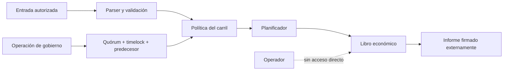

# Política de seguridad

CascadeDTL procesa decisiones económicas deterministas y trata la integridad del estado, la autorización operativa y la reproducibilidad como propiedades de primer nivel.

## Versiones cubiertas

| Versión   | Estado           | Cobertura de seguridad |
| --------- | ---------------- | ---------------------- |
| `1.0.x`   | Activa           | Correcciones y avisos  |
| `< 1.0.0` | Fuera de soporte | Migración requerida    |

La referencia estable es el release más reciente publicado desde `production`. No se consideran entregables estables los commits aislados, artefactos locales ni ramas de trabajo.

## Reporte privado

Utilice **GitHub → Security → Advisories → New draft security advisory** en este repositorio. No publique detalles técnicos en issues, discusiones, pull requests ni canales externos antes de completar la coordinación privada.

Incluya:

- versión, commit y plataforma;
- componente y precondiciones;
- secuencia mínima reproducible;
- diferencia entre resultado esperado y observado;
- impacto sobre reservas, liquidaciones, autorización o disponibilidad;
- registros depurados de secretos y datos personales;
- propuesta de comprobación de regresión, si existe.

## Tiempos objetivo

| Fase                        |                   Objetivo |
| --------------------------- | -------------------------: |
| Acuse de recibo             |          2 días laborables |
| Clasificación inicial       |          5 días laborables |
| Plan de corrección          |         10 días laborables |
| Coordinación de publicación | Según impacto y despliegue |

Los tiempos son objetivos operativos. Una investigación puede requerir más plazo si depende de varios compiladores, estados económicos o integraciones externas.

## Límites de confianza

- El manifiesto de entrada debe llegar autenticado por la capa integradora.
- CascadeDTL valida estructura y consistencia; no sustituye la autenticación upstream.
- El proceso no debe ejecutarse con privilegios administrativos.
- El directorio de entrada debe ser de solo lectura para el proceso de liquidación.
- Los informes deben almacenarse en un canal con control de integridad y retención.
- Las operaciones de política requieren identidad separada de la identidad que ejecuta lotes.

## Activos protegidos

- Capacidad disponible y bloqueada de cada reserva.
- Estado de recibos y paquetes.
- Saldos netos de beneficiarios y cuentas de comisión.
- Orden determinista de ejecución.
- Parámetros de riesgo por carril.
- Ventanas, quórum y precedencias de gobierno.
- Evidencia de ejecución, eventos y artefactos de release.

## Invariantes operativas

- Ningún importe contable puede ser negativo.
- Todo paquete debe referenciar participantes y reservas existentes.
- La comisión está comprendida entre cero y el importe bruto.
- Las operaciones usan enteros con comprobación de overflow.
- Una política se evalúa antes de modificar una reserva.
- El mismo manifiesto y binario producen el mismo orden y el mismo informe.
- Una operación de gobierno cambia de identidad si cambia cualquier campo económico o temporal.
- Un release estable conserva alineados `main`, `production` y su tag anotado.

## Controles de compilación y cadena de suministro

- C11 con `-Wall -Wextra -Wpedantic -Werror` en Linux y `/W4 /WX` en MSVC.
- Dependencias JavaScript instaladas con `npm ci` y lockfile versionado.
- Acciones de GitHub fijadas por versión mayor mantenida.
- Dependabot revisa npm y GitHub Actions.
- La CI no utiliza secretos para compilar o ejecutar pruebas.
- Los artefactos generados, variables de entorno y material privado quedan fuera del control de versiones.

## Gestión de secretos

El repositorio no requiere secretos para compilar, validar manifiestos ni ejecutar la suite. Las integraciones que añadan autenticación deben inyectar credenciales en tiempo de ejecución, limitar su alcance y rotarlas fuera del repositorio. Nunca incluya tokens, claves, credenciales, payloads confidenciales ni volcados completos en una evidencia compartida.

## Respuesta operativa

Ante una señal de integridad:

1. Detener nuevas admisiones del carril afectado.
2. Conservar manifiesto, hash del binario, salida y eventos.
3. No reescribir archivos de evidencia.
4. Conciliar reservas, recibos y saldos por separado.
5. Preparar una operación de política con payload, ventana y predecesor explícitos.
6. Validar la corrección en las plataformas soportadas.
7. Publicar un release alineado y documentar la recuperación.

Consulte [docs/security-model.md](docs/security-model.md) y [docs/operations.md](docs/operations.md) para el modelo completo.
