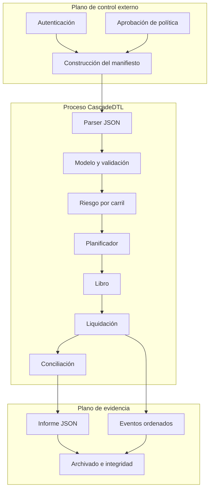
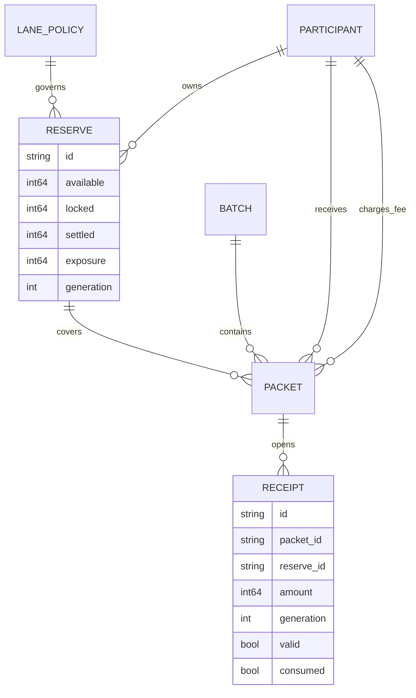

# Arquitectura

## Objetivo

CascadeDTL convierte un manifiesto autorizado de lotes en una secuencia determinista de movimientos económicos. El núcleo no realiza llamadas de red, no consulta relojes del sistema y no usa coma flotante. Epoch, participantes, reservas, políticas y paquetes forman parte explícita de la entrada.

## Límites del sistema

La autenticación y la firma del manifiesto pertenecen al integrador. CascadeDTL valida la coherencia interna y ejecuta la política recibida. El consumidor es responsable de custodiar el informe y asociarlo al hash del binario utilizado.

## Componentes

| Módulo         | Responsabilidad                                    | No realiza                     |
| -------------- | -------------------------------------------------- | ------------------------------ |
| `common.*`     | enteros comprobados, buffers, eventos y utilidades | decisiones de negocio          |
| `json.*`       | parseo autocontenido y acceso tipado               | normalización económica        |
| `model.*`      | carga, referencias y límites estructurales         | ordenación o movimientos       |
| `risk.*`       | admisión por política de carril                    | mutación de reservas           |
| `scheduler.*`  | prioridad efectiva y selección estable             | liquidación                    |
| `ledger.*`     | reservas, recibos y saldos                         | elección del siguiente paquete |
| `settlement.*` | ciclo por ramas, diferimiento y cierre             | serialización                  |
| `reconcile.*`  | agregados por carril                               | cambios de estado              |
| `capital.*`    | haircuts, addons y cobertura                       | ejecución de lotes             |
| `governance.*` | identidad y ciclo de una operación                 | persistencia de firmas         |
| `report.*`     | contrato JSON estable                              | aplicación de políticas        |

## Modelo en memoria

Las colecciones usan capacidades máximas compiladas. Esto evita asignaciones no acotadas durante una ejecución y hace visible el límite operativo:

- 96 participantes;
- 128 reservas;
- 384 paquetes;
- 96 lotes;
- 768 recibos;
- 32 políticas de carril.

Los eventos sí usan un vector dinámico controlado. Cualquier error de asignación detiene la ejecución sin producir un informe parcial válido.

## Dependencias de datos

Las referencias se resuelven al cargar. Un identificador duplicado, una reserva sin propietario o un paquete sin beneficiario invalidan el manifiesto completo.

## Determinismo

Una ejecución es determinista si se mantienen:

1. el mismo contenido de manifiesto;
2. el mismo binario;
3. las mismas opciones de CLI;
4. el mismo orden de arrays de entrada.

No se usan hora local, aleatoriedad, red, variables de entorno económicas ni estado persistente. El planificador desempata por la secuencia de carga. El informe enumera colecciones en orden de almacenamiento, y los eventos siguen el orden de transición.

## Portabilidad

El código se compila como C11 en Linux y Windows. Los enteros económicos son `int64_t`; cualquier multiplicación usada por capital o límites pasa por funciones de overflow. El SDK representa esos mismos valores con `bigint` y no los transforma en `number` durante la decodificación.

## Extensión segura

Para añadir un campo económico:

1. definir rango y unidad;
2. parsearlo con valor por defecto explícito;
3. validarlo antes del planificador;
4. usar aritmética comprobada;
5. emitirlo en el informe si condiciona decisiones;
6. añadir un caso de borde y uno de overflow;
7. documentar compatibilidad del esquema.

Una extensión que dependa de datos externos debe resolverlos y fijarlos antes de construir el manifiesto; el núcleo no debe introducir consultas implícitas.
