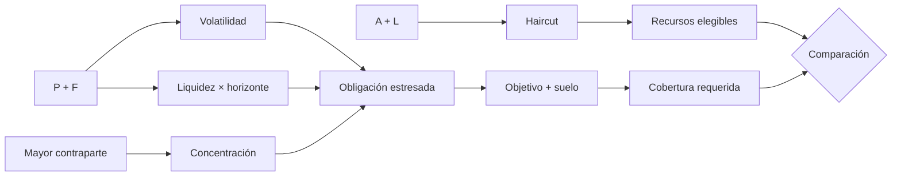
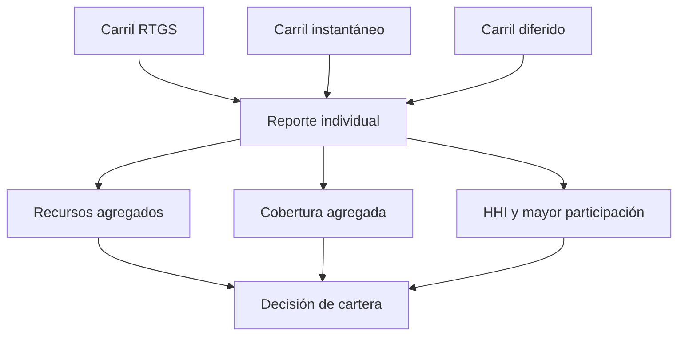

# Modelo económico

## Unidades y redondeo

Todos los importes se expresan en la unidad atómica del activo de liquidación. Las tasas usan puntos básicos (`10.000 = 100 %`). El horizonte usa epochs enteros definidos por el operador.

Las deducciones sobre recursos elegibles redondean hacia abajo. Los ajustes sobre obligaciones y la cobertura requerida redondean hacia arriba. Esta asimetría evita declarar capacidad a partir de fracciones no materializadas.

| Cálculo                | Dirección |
| ---------------------- | --------- |
| Reserva elegible       | `floor`   |
| Addon de volatilidad   | `ceil`    |
| Addon de liquidez      | `ceil`    |
| Addon de concentración | `ceil`    |
| Cobertura requerida    | `ceil`    |
| Ratio informativo      | `floor`   |

## Recursos elegibles

Sea `A` la reserva disponible, `L` la bloqueada y `h` el haircut:

```text
eligible_available = floor(A × (10_000 - h) / 10_000)
eligible_locked    = floor(L × (10_000 - h) / 10_000)
eligible_resources = eligible_available + eligible_locked
```

El mismo haircut se aplica a ambas categorías para mantener una política conservadora y auditable. Si una integración distingue calidad o liquidez, debe separar reservas en carriles con políticas distintas.

## Obligación estresada

Para pendiente bruto `P`, comisiones esperadas `F`, mayor contraparte `C`, volatilidad `v`, liquidez por epoch `l`, concentración `c` y horizonte `t`:

```text
volatility_addon    = ceil(P × v / 10_000)
liquidity_addon     = ceil(P × l × t / 10_000)
concentration_addon = ceil(C × c / 10_000)

stressed_obligation = P + F
                     + volatility_addon
                     + liquidity_addon
                     + concentration_addon
```

El término de liquidez escala linealmente con el horizonte. Antes de usar horizontes largos, el responsable de riesgo debe validar que esa aproximación sigue siendo prudente; si la relación no es lineal, se deben definir carriles por tenor.

## Cobertura requerida

Con objetivo `q` y suelo operativo `O`:

```text
required_coverage = ceil(stressed_obligation × q / 10_000) + O
surplus           = max(eligible_resources - required_coverage, 0)
shortfall         = max(required_coverage - eligible_resources, 0)
coverage_bps      = floor(eligible_resources × 10_000 / required_coverage)
```

`q` debe estar entre 10.000 y 30.000 puntos básicos. El suelo operativo cubre una cantidad absoluta que no depende del volumen y permite representar costes de cierre, fricción o reservas mínimas.



## Ejemplo calculado

Parámetros:

| Campo                |            Valor |
| -------------------- | ---------------: |
| Disponible           |          300.000 |
| Bloqueada            |           50.000 |
| Pendiente bruto      |          180.000 |
| Comisiones esperadas |              900 |
| Mayor contraparte    |           90.000 |
| Haircut              |          800 bps |
| Volatilidad          |          650 bps |
| Liquidez             | 40 bps por epoch |
| Concentración        |        1.200 bps |
| Horizonte            |         3 epochs |
| Objetivo             |       12.500 bps |
| Suelo                |           25.000 |

Resultado:

| Métrica                |      Valor |
| ---------------------- | ---------: |
| Recursos elegibles     |    322.000 |
| Addon de volatilidad   |     11.700 |
| Addon de liquidez      |      2.160 |
| Addon de concentración |     10.800 |
| Obligación estresada   |    205.560 |
| Cobertura requerida    |    281.950 |
| Excedente              |     40.050 |
| Cobertura              | 11.420 bps |

## Agregación de cartera

El SDK calcula cada carril con su propia política y después suma recursos y cobertura requerida. También informa concentración HHI:

```text
share_i = floor(pending_i × 10_000 / total_pending)
hhi_bps = Σ floor(share_i² / 10_000)
```



Una cartera solo satisface la política cuando no presenta déficit agregado y todos los carriles satisfacen su política individual. No se permite que el excedente de un carril oculte un incumplimiento local.

## Selección de parámetros

- `reserveHaircutBps`: calidad y disponibilidad de la cobertura.
- `volatilityBps`: variación adversa durante el ciclo de liquidación.
- `liquidityBps`: coste incremental por epoch hasta cierre.
- `concentrationBps`: penalización sobre la mayor contraparte.
- `targetCoverageBps`: colchón prudencial sobre la obligación estresada.
- `operationalFloor`: coste mínimo absoluto de continuidad o cierre.

Los parámetros deben aprobarse mediante una operación de gobierno, versionarse y quedar asociados al manifiesto procesado.
