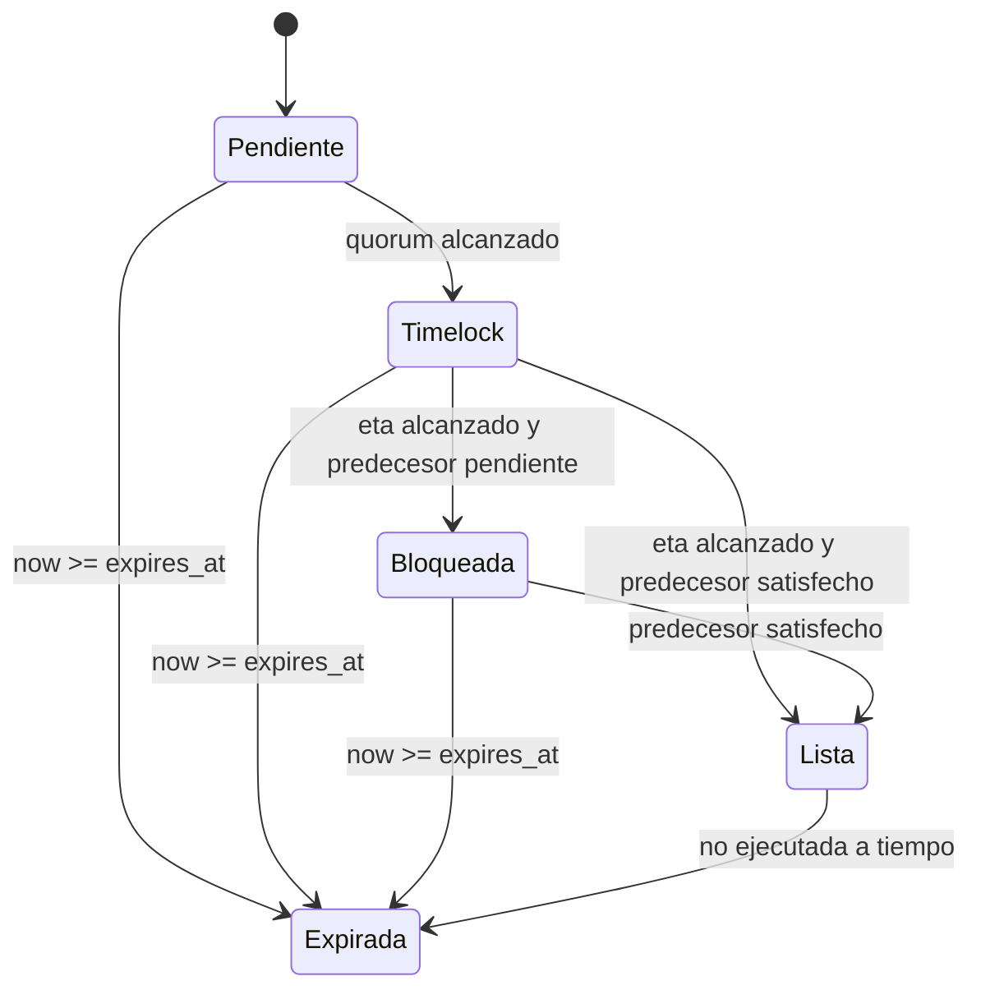
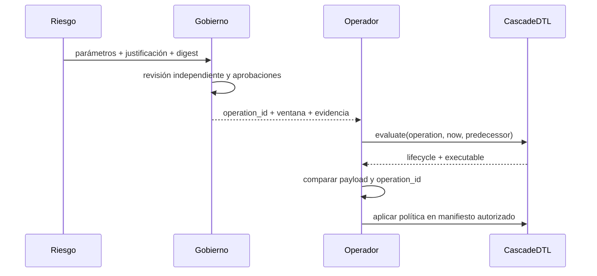

# Gobierno

## Propósito

El módulo de gobierno proporciona una identidad determinista y una evaluación local para cambios de política. No almacena firmas ni ejecuta cambios: verifica que una intención aprobada conserva el mismo dominio económico y temporal en cada integración.

## Dominio de operación

```text
CASCADE_GOVERNANCE_V1
| protocol
| network
| chain_id
| target
| selector
| payload_digest
| predecessor
| salt
| eta
| expires_at
| quorum
```

La cadena canónica se procesa con el hash estable del núcleo y produce un identificador hexadecimal de 64 bits. Este identificador sirve para correlación operativa; si una integración necesita resistencia criptográfica, debe firmar además la cadena canónica con un algoritmo aprobado y conservar ambos valores.

## Campos

| Campo            | Función                                            |
| ---------------- | -------------------------------------------------- |
| `protocol`       | separa el dominio de CascadeDTL de otros productos |
| `network`        | distingue entornos y redes                         |
| `chain_id`       | evita reutilización entre cadenas                  |
| `target`         | componente receptor de la política                 |
| `selector`       | acción concreta                                    |
| `payload_digest` | compromiso con todos los parámetros                |
| `predecessor`    | dependencia causal explícita                       |
| `salt`           | separa operaciones repetidas                       |
| `eta`            | inicio de ejecución                                |
| `expires_at`     | fin exclusivo de ejecución                         |
| `quorum`         | mínimo de aprobaciones independientes              |

## Ciclo



La evaluación da prioridad a expiración, después aprobaciones, timelock, predecesor y disponibilidad. Así, una operación vencida nunca vuelve a aparecer como ejecutable aunque reúna quórum.

## Flujo recomendado



## Ejemplo

```bash
out/cascadedtl governance \
  CascadeDTL testnet 84532 reserve-registry set-policy \
  8a36f1 none 2026q3 \
  1700000000 1700003600 3 3 1700000100 1
```

Salida abreviada:

```json
{
  "operationId": "365426de23338105",
  "lifecycle": "ready",
  "approvalsRemaining": 0,
  "predecessorSatisfied": true,
  "executable": true
}
```

## Rotación y emergencia

- Una rotación de aprobadores debe ser una operación separada.
- Reducir quórum requiere una ventana mayor que un ajuste ordinario.
- La parada de un carril puede tener un selector específico, pero debe conservar payload y expiración.
- Una cancelación se registra en la capa persistente; el núcleo no debe reinterpretarla como ausencia de aprobaciones.
- El salt no sustituye al nonce persistente del sistema de gobierno.

## Evidencia mínima

Conservar juntos:

- cadena canónica;
- `operationId`;
- digest criptográfico externo, si aplica;
- identidad y timestamp de cada aprobación;
- resultado de la evaluación;
- manifiesto efectivo;
- hash del binario;
- informe posterior y conciliación.
