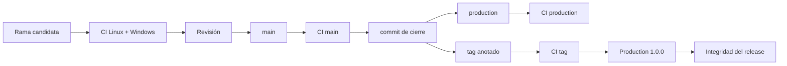

# Operaciones

## Entrega

La unidad estable está formada por un commit único referenciado por:

- `main`;
- `production`;
- tag anotado `v1.0.0`;
- release `Production 1.0.0`.

La CI debe estar verde en candidato, `main`, `production`, tag y publicación. Un hash divergente invalida la promoción.



## Preparación del host

- Usuario sin privilegios administrativos.
- Directorio del binario no escribible por el proceso.
- Directorio de manifiestos de solo lectura durante una ejecución.
- Directorio de salida separado y con cuota.
- Node.js 24 para SDK y verificaciones.
- Compilador solo necesario en build, no en el host de ejecución.

## Procedimiento de ejecución

1. Verificar hash y versión del binario.
2. Verificar firma y hash del manifiesto.
3. Ejecutar `validate`.
4. Ejecutar el modelo de capital con la política aprobada.
5. Confirmar que la operación de gobierno está en estado `ready` cuando haya cambio de parámetros.
6. Ejecutar `run --json --events`; añadir `--strict` donde se requiera cobertura completa.
7. Escribir la salida en un archivo nuevo, nunca sobre la entrada.
8. Conciliar reservas, saldos, comisiones y paquetes terminales.
9. Archivar entrada, salida, eventos, hashes y operación de gobierno.

## Observabilidad

| Señal                    | Fuente   | Acción                                   |
| ------------------------ | -------- | ---------------------------------------- |
| `packet_policy_rejected` | eventos  | revisar límites del carril               |
| `packet_deferred`        | eventos  | vigilar edad y siguiente epoch           |
| `packet_review`          | eventos  | congelar admisión del carril             |
| `reserve_exposure`       | eventos  | detener y conciliar cobertura            |
| `grossExposure > 0`      | métricas | escalar según política                   |
| `receiptReplays`         | métricas | correlacionar con reintentos autorizados |
| `shortfall > 0`          | capital  | bloquear nueva capacidad                 |
| `lifecycle != ready`     | gobierno | no aplicar el cambio                     |

Los eventos no incluyen datos personales por diseño. Los identificadores operativos deben ser pseudónimos y no contener credenciales.

## Conciliación de cierre

```text
total reserve state = Σ available + Σ locked + Σ settled
participant credits = Σ received + Σ fees
terminal packets     = settled + failed + review
pending packets      = new + queued + deferred
```

La comparación exacta depende del modelo de financiación upstream. CascadeDTL entrega ambos lados del movimiento para que el integrador valide su ecuación de conservación.

## Recuperación

Ante una divergencia:

1. no reintentar automáticamente;
2. inmovilizar el manifiesto y la salida;
3. registrar commit, plataforma y compilador;
4. aislar el primer evento divergente;
5. conciliar el carril afectado sin compensar con otros carriles;
6. preparar una política temporal con expiración;
7. ejecutar la recuperación sobre una copia de estado;
8. obtener aprobación independiente antes de reanudar.

## Capacidad

Los máximos compilados son límites duros. El operador debe alertar antes del 80 % de participantes, reservas, paquetes, lotes o recibos. La solución a un crecimiento sostenido es particionar por periodo o carril; no aumentar límites sin medir memoria y tiempo de ejecución.

## Backups y retención

Conservar al menos:

- manifiesto original y firma;
- binario o hash reproducible;
- salida JSON;
- eventos;
- política de capital;
- operación de gobierno;
- resultado de CI del release.

La retención debe ajustarse al periodo de reversión y conciliación del sistema downstream. Un backup debe probarse mediante restauración y reproducción determinista, no solo mediante presencia del archivo.
