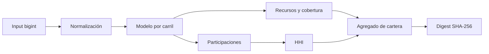

# SDK JavaScript

## Alcance

`sdk/cascade-client.mjs` ofrece:

- ejecución local confinada de `validate`, `run`, `capital` y `governance`;
- aritmética offline equivalente al módulo C de capital;
- agregación de cartera y concentración HHI;
- decodificación exacta de enteros JSON a `bigint`;
- normalización estricta de políticas e identificadores.

No abre conexiones de red ni lee variables de autenticación.

## Construcción

```js
import { CascadeClient } from "./sdk/cascade-client.mjs";

const client = new CascadeClient({
  binaryPath: "./out/cascadedtl",
  root: process.cwd(),
  timeoutMs: 10_000,
});
```

`binaryPath` se convierte a ruta absoluta. `root` delimita los manifiestos accesibles. `timeoutMs` admite 100..120.000 ms. El transporte usa `spawnSync` con `shell: false`, ventana oculta en Windows y 8 MiB de salida máxima.

## Validación y ejecución

```js
const valid = client.validate("tests/fixtures/balanced_settlement.json");
const state = client.run("tests/fixtures/balanced_settlement.json", {
  events: true,
  strict: false,
});

console.log(state.metrics.grossSettled); // bigint
```

Una ruta absoluta fuera de `root`, una secuencia `..`, un byte nulo o un proceso no concluido producen una excepción.

## Capital

```js
const input = {
  reserveAvailable: 300_000n,
  reserveLocked: 50_000n,
  pendingGross: 180_000n,
  expectedFees: 900n,
  largestCounterparty: 90_000n,
};

const policy = {
  reserveHaircutBps: 800,
  volatilityBps: 650,
  liquidityBps: 40,
  concentrationBps: 1_200,
  horizonEpochs: 3,
  targetCoverageBps: 12_500,
  operationalFloor: 25_000n,
};

const online = client.capital(input, policy);
```

`computeCapital(input, policy)` ejecuta la misma fórmula sin iniciar el binario. La suite compara ambos resultados campo a campo.

## Cartera

```js
import { portfolioStress } from "./sdk/cascade-client.mjs";

const portfolio = portfolioStress([
  { id: "rtgs", input, policy },
  {
    id: "instant",
    input: {
      reserveAvailable: 50_000n,
      reserveLocked: 0n,
      pendingGross: 90_000n,
      expectedFees: 200n,
      largestCounterparty: 60_000n,
    },
    policy,
  },
]);

console.log(portfolio.aggregate.shortfall);
console.log(portfolio.aggregate.hhiBps);
console.log(portfolio.aggregate.digest);
```



El digest liga ID, pendiente, cobertura requerida y déficit de cada carril en el orden recibido. Es evidencia de correlación, no sustituye una firma.

## Gobierno

```js
const operation = {
  protocol: "CascadeDTL",
  network: "testnet",
  chainId: 84_532,
  target: "reserve-registry",
  selector: "set-policy",
  payloadDigest: "8a36f1",
  predecessor: "none",
  salt: "2026q3",
  eta: 1_700_000_000n,
  expiresAt: 1_700_003_600n,
  quorum: 3,
  approvals: 3,
};

const decision = client.governance(operation, {
  now: 1_700_000_100n,
  predecessorSatisfied: true,
});
```

## Tipos aceptados

Los importes aceptan:

- `bigint`;
- `number` solo si es entero seguro;
- string decimal canónico.

Se rechazan decimales, exponentes, `NaN`, infinitos, strings con signo positivo y valores fuera de `int64_t`.

## Errores

| Error                       | Comportamiento                |
| --------------------------- | ----------------------------- |
| Entrada inválida            | `TypeError` antes de ejecutar |
| Ruta fuera de root          | `TypeError`                   |
| Timeout o error del sistema | error nativo de proceso       |
| Salida no cero              | `Error` con stderr depurado   |
| JSON no entero              | `TypeError` o error de parseo |

No incluya stderr sin depurar en sistemas de telemetría si el integrador añade campos sensibles a las rutas o identificadores.
