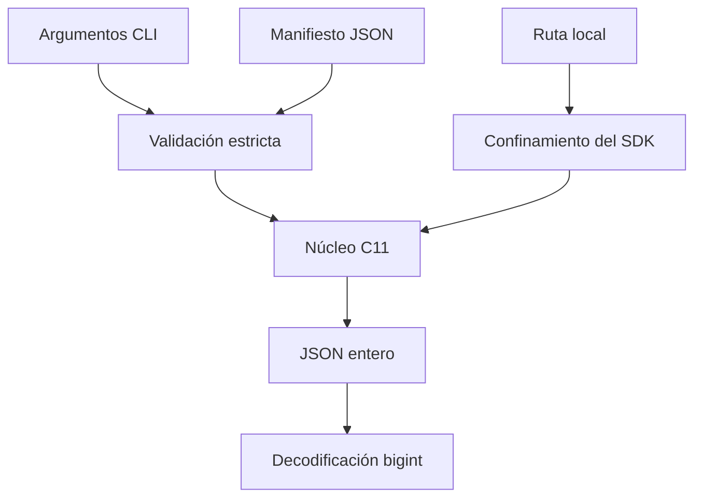
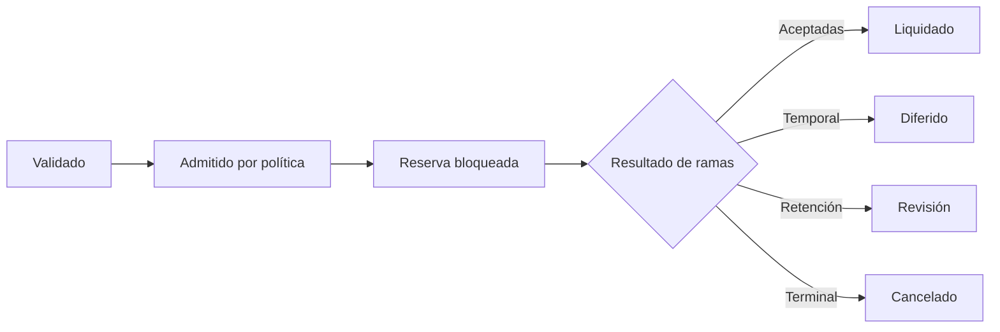

# Modelo de seguridad

## Objetivos

El diseño prioriza:

1. integridad de reservas y saldos;
2. autorización inequívoca de políticas;
3. determinismo de ejecución;
4. contención de entradas y recursos;
5. evidencia suficiente para reconstrucción.

## Actores

| Actor                      | Capacidad                  | Restricción                  |
| -------------------------- | -------------------------- | ---------------------------- |
| Constructor de manifiestos | define lotes y referencias | no modifica el binario       |
| Aprobador de riesgo        | define política económica  | no ejecuta lotes             |
| Operador                   | inicia la ejecución        | no altera entradas aprobadas |
| Custodio de evidencia      | archiva salida y hashes    | no reordena eventos          |
| Consumidor downstream      | aplica el resultado        | valida commit y esquema      |

La separación de funciones evita que una sola identidad prepare, apruebe, ejecute y certifique una decisión económica.

## Superficies de entrada



- La CLI acepta únicamente números decimales enteros para parámetros económicos.
- Los identificadores de gobierno tienen 1..63 caracteres y excluyen delimitadores canónicos.
- El SDK ejecuta el binario sin shell.
- Las rutas se resuelven bajo un root configurado y no pueden escapar mediante `..`.
- El proceso tiene timeout y límite de salida.
- El parser rechaza decimales y notación exponencial para importes.

## Aritmética

El tipo económico es `int64_t`. Sumas, restas y multiplicaciones que pueden exceder el dominio usan comprobaciones previas. Las tasas se aplican mediante multiplicación seguida de división entera con dirección de redondeo documentada.

No se convierte un importe C a `number` en el SDK. Un token entero JSON se transforma directamente en `bigint`, incluidos los límites `-2^63` y `2^63 - 1`.

## Estado y transiciones



Las decisiones de política ocurren antes de la apertura. Los eventos se añaden después de cada transición relevante y contienen epoch, paquete, reserva, importe y resultado cuando corresponde.

## Invariantes verificables

| Dominio  | Invariante                                        |
| -------- | ------------------------------------------------- |
| Modelo   | IDs únicos y referencias existentes               |
| Paquete  | `0 <= fee <= amount`                              |
| Reserva  | `available`, `locked` y `settled` nunca negativos |
| Política | tasas dentro de rango y horizonte acotado         |
| Capital  | obligación y recursos sin overflow                |
| Gobierno | ventana ordenada, quórum 1..32, dominio canónico  |
| Salida   | orden estable para una entrada idéntica           |

Cuando `--strict` está activo, cualquier exposición positiva invalida la ejecución. En operación normal se recomienda `--strict` para carriles cuya política exija cobertura completa.

## Gobierno

La identidad de operación incluye dominio de protocolo, red, cadena, destino, selector, digest del payload, predecesor, salt, ventana y quórum. Las aprobaciones no forman parte del identificador porque son evidencia acumulada sobre la misma intención.

Una operación es ejecutable únicamente si:

```text
approvals >= quorum
and now >= eta
and now < expires_at
and predecessor_satisfied
```

## Controles del repositorio

- Formato reproducible con Prettier.
- Compilación estricta en GCC/Clang y MSVC.
- Pruebas funcionales y de contrato de CLI.
- Verificador de archivos requeridos y enlaces documentales.
- Rechazo de archivos privados y artefactos generados.
- CI en dos sistemas operativos.
- Comprobación independiente de ramas, tag anotado y release.

## Riesgos residuales

CascadeDTL no autentica el origen del manifiesto, no firma el informe y no persiste aprobaciones. Estas funciones pertenecen a la integración. Un despliegue debe fijar:

- formato de firma y rotación de claves;
- almacenamiento inmutable de entradas y salidas;
- identidad del binario mediante hash;
- retención y acceso a eventos;
- regla de parada ante divergencia de conciliación;
- política de recuperación por carril.
