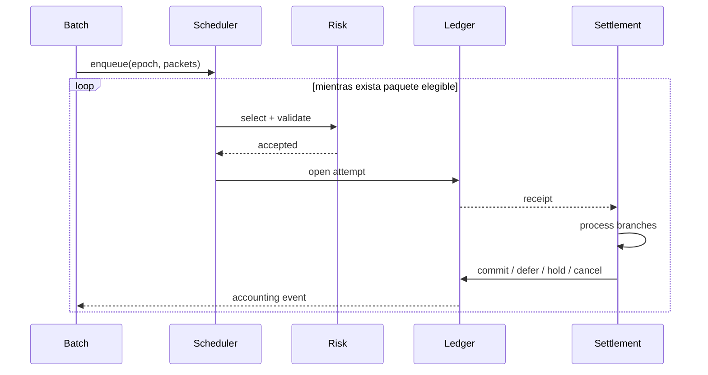
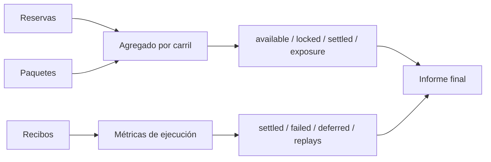

# Ciclo de liquidación

## Entidades

Un lote agrupa paquetes para un epoch lógico. Cada paquete define reserva, beneficiario, cuenta de comisión, importe bruto, prioridad, peso de congestión, número de ramas y política de reintento. Un recibo vincula el intento al importe y a la generación observada de la reserva.

## Admisión

La carga rechaza de forma atómica:

- identificadores ausentes o duplicados;
- referencias a participantes o reservas inexistentes;
- importes no positivos;
- comisiones negativas o superiores al bruto;
- intentos, delays o ramas fuera de rango;
- políticas con tasas fuera de 0..10.000 puntos básicos.

Después, la política del carril comprueba importe máximo, comisión máxima, prioridad mínima, presencia de cuenta de comisión y permiso para reintentos.

## Prioridad

La prioridad efectiva combina tres términos:

```text
score = base_priority
      + queued_packets × congestion_per_packet × congestion_weight
      + retry_boost, si attempts > 0
```

El paquete elegible con mayor `score` se ejecuta primero. Si hay empate, gana la menor secuencia original. Un paquete diferido solo vuelve a ser elegible cuando `current_epoch >= not_before_epoch`.



## Estados

| Estado     | Significado                              | Terminal             |
| ---------- | ---------------------------------------- | -------------------- |
| `new`      | cargado, aún no admitido                 | no                   |
| `queued`   | intento en curso                         | no                   |
| `deferred` | espera un epoch posterior                | no                   |
| `settled`  | principal y comisión acreditados         | sí                   |
| `failed`   | condición terminal o rechazo de política | sí                   |
| `review`   | reserva retenida para intervención       | sí en esta ejecución |

## Contabilidad

En una apertura fresca, el importe pasa de `available` a `locked`. Al liquidar, disminuye `locked`, aumenta `settled`, se acredita `amount - fee` al beneficiario y `fee` a la cuenta designada.

```text
reserve.available -= amount
reserve.locked    += amount

reserve.locked   -= consumed_lock
reserve.settled  += amount
beneficiary      += amount - fee
fee_account      += fee
```

Los campos `available`, `locked`, `settled` y `exposure` se reportan por reserva y agregados por carril. `generation` avanza con cada transición que modifica cobertura.

## Reintentos

Una rama puede solicitar:

- cancelación terminal;
- retención de revisión;
- diferimiento conservando cobertura;
- diferimiento devolviendo cobertura a disponible.

El epoch siguiente se calcula como `current_epoch + retry_delay`. `max_attempts` limita la vida del paquete. El manifiesto debe elegir conscientemente si la cobertura queda retenida o vuelve a la cola de capacidad.

## Conciliación



La conciliación no modifica estado. Un consumidor debe comparar al menos capacidad, liquidado, exposición, número de paquetes terminales, comisiones y participantes acreditados.

## Ejemplo mínimo

```json
{
  "scenario": "daily-clearing",
  "participants": [
    { "id": "reserve-owner", "balance": 0 },
    { "id": "merchant", "balance": 0 },
    { "id": "operator", "balance": 0 }
  ],
  "reserves": [{ "id": "cov-main", "owner": "reserve-owner", "lane": "rtgs", "available": 100000 }],
  "batches": [
    {
      "id": "batch-001",
      "epoch": 42,
      "packets": [
        {
          "id": "packet-001",
          "reserve": "cov-main",
          "beneficiary": "merchant",
          "feeAccount": "operator",
          "amount": 25000,
          "fee": 125,
          "priority": 20,
          "congestionWeight": 2,
          "maxAttempts": 1,
          "retryDelay": 1,
          "legs": 2
        }
      ]
    }
  ]
}
```

El resultado esperado deja 75.000 disponibles, 25.000 liquidados, 24.875 en el beneficiario y 125 en la cuenta de comisión.
